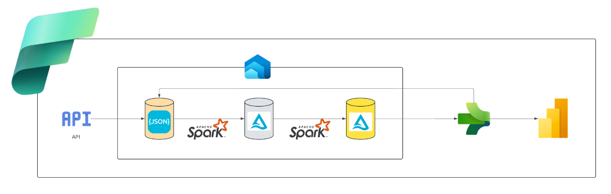
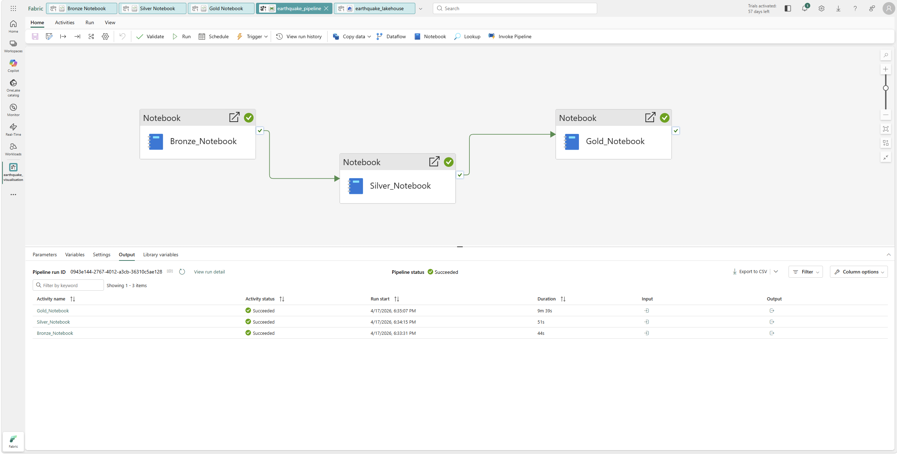

# Earthquake Azure Data Pipeline

## 🌍 Project Overview

This project implements a full data engineering pipeline on Microsoft Fabric to automate the ingestion, transformation, enrichment, and visualization of global earthquake data. The goal is to transform raw seismic event data from the USGS API into actionable insights using Fabric's Lakehouse, PySpark, Data Factory, and Power BI components.

## 📊 Business Requirements

Earthquake data is incredibly valuable for understanding seismic events and mitigating risks. Government agencies, research institutions, and insurance companies rely on up-to-date information to plan emergency responses and assess risks. With this automated pipeline, we ensure these stakeholders get the latest data in a way that’s easy to understand and ready to use, saving time and improving decision-making.

## 🏗️ Solution Architecture

The pipeline is designed following the medallion architecture, organizing data into three progressive layers:

- Bronze Layer: Raw ingestion of earthquake data.
- Silver Layer: Transformation and cleaning into structured tables.
- Gold Layer: Enrichment with derived metrics (e.g., country codes, significance classifications).
- Power BI Integration: Interactive dashboards for visualization.
- Data Factory Automation: End-to-end orchestration of the pipeline on a daily schedule.

## 🔄 Pipeline Automation

The automation is implemented using Fabric Data Factory pipelines:

- Each notebook (bronze, silver, gold) is a pipeline activity.
- Parameters for start and end dates are dynamically generated for daily runs.
	- Bronze: Start Date @formatDateTime(addDays(utcnow(), -1), 'yyyy-MM-dd'), End Date @formatDateTime(utcnow(), 'yyyy-MM-dd')
	- Silver: Start Date @json(activity('Bronze_Notebook').output.result.exitValue).start_date
	- Gold: Start Date @json(activity('Silver_Notebook').output.result.exitValue).start_date
- Activities are linked with success dependencies, ensuring proper sequence.
- The pipeline is scheduled to run every 24 hours, providing continuous data updates.

## 📊 Power BI Integration

The gold layer feeds into the Fabric semantic model, exposed via the Lakehouse SQL endpoint. A Power BI report is built directly on top of the semantic model, offering:

- Map visuals displaying event locations by country.
- Slicers for date ranges and significance levels.
- Multi-row cards showing total events and maximum significance.

## ⚡ Technical Highlights

- Fully serverless, scalable architecture within Microsoft Fabric.
- PySpark notebooks leveraging the Lakehouse Delta format.
- Reverse geocoding integration to enhance spatial insights.
- Automated orchestration and monitoring with Fabric Data Factory.
- Seamless Power BI integration for stakeholder-facing dashboards.

## 🚀 Future Improvements

- Integrate external datasets (e.g., population density) for richer risk analysis.
- Add anomaly detection models for early warning systems.
- Enhance the Power BI report with predictive visualizations.

## ✅ Conclusion

This project showcases a modern, end-to-end data engineering solution using Microsoft Fabric, demonstrating how to transform raw API data into automated, actionable insights with minimal manual intervention. It highlights best practices in medallion architecture, pipeline orchestration, and integrated visualization — paving the way for more advanced data science and analytics initiatives.